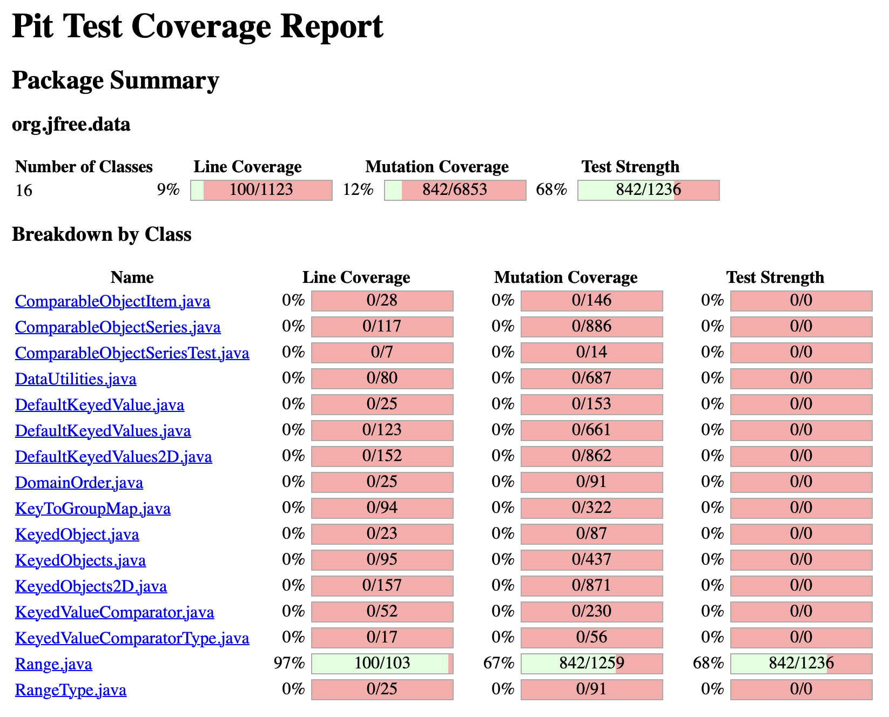
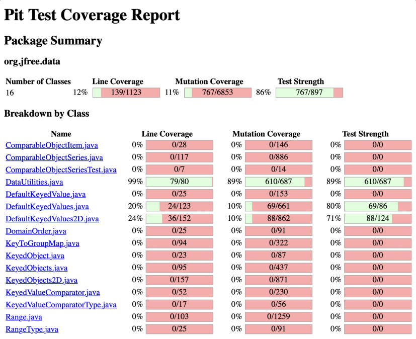

**SENG 438 - Software Testing, Reliability, and Quality**

**Lab. Report \#4 – Mutation Testing and Web app testing**

| Group \#:      |  15   |
| -------------- | --- |
| Student Names: |  Manraj Singh   |
|                |  Sajan Hayer   |
|                |  Noor Nawaz   |
|                |  Ahmad Elshiltawi   |

# Introduction
The objective of this lab was to learn more about the process of implementing mutation tests and learning how to be able to test interfaces with different Web testers and GUI testers. In particular, we were able to explore how to use PiTest to analyze and increase the mutation coverage of our test suite. Through mutation testing, we as test writers can ensure that the quality of the test suite is adequate. Another advantage of implementing mutation testing is that we are able to gain a deeper understanding about how the tests we write are more thorough and can expose bugs that may not be covered by writing basic, trivial test cases. The second part of this lab involved being able to test a user-interface with Selenium, in which we tested the ikea website. We were able to automate these tests using the Selenium IDE and create scripts of these tests for future use. A deeper understanding was gained for being able to use GUI testing as we got to compare how two different IDEs functioned in being able to test different functionalities of an interface. 

# Analysis of 10 Mutants of the Range class 
**public boolean contains(double value)** → Boundary value Mutant Survived
Analysis: The mutant demonstrated that we did not test the boundary conditions for this function. 
The range we sent to the function was (-1,1) and we missed the tests that checked whether -1 or 1 would be within the range 

**public boolean intersects(double b0, double b1)** → Boundary value mutant Survived 
Analysis: This mutant showed that we needed to test the boundary conditions of our range with this function. If our range was (-1, 1) we would need to create tests the would check the ranges of (-1, -1) as well as (1, 1)

**public static Range shift(Range base, double delta)** → Replaced double addition with subtraction KILLED
Analysis: This mutant replaced the operator within the function to a subtraction one. This mutant was killed with our tests as with values big enough to not be affected by the change in operator. This allowed for our tests to kill this mutant with our original test suite

**public boolean intersects (Range range)** → Replaced Boolean Return with False Survived
Analysis: This mutant showed us that we did not have a test where the expected return value was true. To combat this we would be required to write a test that would send a new range from (-0.5, 0.5)  to the function allowing us to get a return value of true 

**public boolean constrain(double value)** → Boundary value mutant Survived 
Analysis: Within this function  at line 190 there is the if statement value > this.upper. The mutant tested whether we satisfied the boundary condition of this test which did not occur. If our range was (-1, 1) we would need to create tests that would send values of -1 or 1 

**public static Range combine(Range range1, Range range2)** → Relational operator Replacement Mutant Killed,
Analysis: This mutant switched  the operator from == to != within this function. This mutation was killed within our tests as we had multiple tests to determine accurate results whether they involved a null range or not.  

**public static Range combineIgnoringNaN(Range range1, Range range2)** → Return statement replacement mutation Killed, 
Analysis: This mutant replaced the return function at line 245 with a NULL value. Our tests were able to detect this as we compared expected results which were accurate to the ones that were returned. 

**private static double max(double d1, double d2)** →  Negated double local variable number 2 → SURVIVED, 
Analysis: This mutation was not killed within our original test suite as we did not test for what would happen if one of the local variables got negated

**public static Range expandToInclude(Range range, double value)** →  removed conditional - replaced equality check with true → KILLED 
Analysis: This mutant removed the check condition within our test to true, to determine if we were able to detect a NULL value was sent to this function. Our original tests did cover this mutant so we were able to pick up the mutation.

**public static Range expand(Range range,  double lowerMargin, double upperMargin)** → Incremented (a++) double local variable number 1  SURVIVED 
Analysis: This mutation incremented one of the local variables within the functions by the ++ operator. Our original test suite was not able to cover this mutation so it was able to survive the testing phase.

# Report all the statistics and the mutation score for each test class
**Inital Score for Range class:**

**Final Score for Range class:**

**Inital Score for DataUtilities class:**

**Final Score for DataUtilities class:**

# Analysis drawn on the effectiveness of each of the test classes
We were able to improve both of our mutation coverages for our test classes. For our RangeTest file we were able to achieve a 10% increase in mutation coverage as we had roughly ~70% coverage initially which allowed us to improve this class. We added roughly around 50 more tests to increase the mutation coverage covering many different types of mutations that arose. With the DataUtilitiesTest file we were only able to achieve an increase of 1% for the mutation coverage. Since our initial coverage was very high at 89% this made it difficult to increase the mutation coverage as the mutations that were left were either equivalent mutations or they were too difficult to achieve through testing. To gain this increase we were able to fix and test for the exceptions within each of the functions within the DataUtilities Test file. 

# A discussion on the effect of equivalent mutants on mutation score accuracy
Equivalent mutants did have a decent effect on mutation score accuracy. This is due to the fact that you are not able to Kill these mutations with tests which do affect the score accuracy. This was a major challenge involving both files as there many equivalent mutants that appeared which reduced the mutation score accuracy. It was especially difficult within the DataUtilities tests as much of the mutations were already covered with our tests and only equivalent mutants remained. This created issues in getting the 10% increase as the mutants were just too difficult to Kill or there were not enough of them to get the amount required.

# A discussion of what could have been done to improve the mutation score of the test suites
The mutation score of a test is based on two conditions: whether a mutant survives or a mutant is killed. To improve mutation scores, testers can write additional test cases that target specific mutants that may have survived. Some of these mutants can be killed by creating tests that target boundary value conditions, which may have been missed in the initial test suite. These boundary value mutants were more evident for the Range class, thus more tests targeted boundary conditions to improve the score. Another way to improve mutation score is by writing test cases that will fail in case mutants are introduced. Improving mutation score will also improve the robustness of our testing suite.

# Why do we need mutation testing? Advantages and disadvantages of mutation testing
Mutation testing is a critical portion of the testing phase during the software development life cycle because it allows testers to ensure the quality of the software testing suite. This method of software testing promotes testers to have a goal of writing tests that detect all mutated code, therefore the goal is to write code that kills all mutants. Mutation testing also forces writers to write more test cases that may detect further bugs with edge cases not observable with other forms of testing. Mutation testing allows us to build a more robust, thorough and comprehensive testing suite. It allows us to measure the effectiveness of a test suite in its ability to detect faults. Mutation testing further proves that despite having high code coverage, the test suite may still not be robust as it may not possess the ability to detect mutants. 

Advantages of mutation testing:
  - Improvement in quality of test suite
  - Allows test designers to determine missed areas of testing
  - Early identification of faults can reduce costs and prevent production failure

Disadvantages of mutation testing:
  - Running mutation tests takes lots of computational power and time to run tests
  - Thorough knowledge of mutation testing is required to successfully interpret the results
  - Automations for mutation testing may be required for mutation testing on large scale systems

# Explain your SELENIUM test case design process
To test the IKEA website, we initially explored the website as a group to understand core functionalities and important functions that we could test. After discussing the core functionalities, we decided on the Logging In functionality, Cart Functionality, Search Bar functionality and Sort Dropdown functionality. Each of those functions were turned into a test suite, and consisted of two tests (one valid and one invalid). After understanding how to record, replay and add assertions into the selenium test cases, we had 8 automated tests. By adding assertions at the end, we mainly looked for web elements that would be present as a result of performing the automated tests. This allowed us to understand if the automated test was getting to the appropriate final state as the tests completed. 

# Explain the use of assertions and checkpoints
Assertions and checkpoints are used to ensure that the system is behaving as expected, and more specifically, if the SUT is reaching the appropriate state as a result of a sequence of events. These are done automatically by the Selenium IDE browser extension. Furthermore, Selenium adds these assertions automatically after an event occurs (mouse event, click event, etc.). Due to the fact that web testing can be automated and it is sometimes difficult to have set/specific return values, due to the dynamic nature of web applications, checkpoints can be used to test expected values of elements in the UI.  

# How did you test each functionaity with different test data
When selenium is recording a user’s actions when performing a set of events on a user interface, it automatically updates the “Value” field based on the events and the data provided. This can also be done manually by changing the value field with other data, therefore promoting variability in the data that is used for the tests. An example of testing the overall login functionality is splitting the test suite into two cases; one test with valid login data, and one test with invalid login data. For the valid data test, we ensured that the result of the successful login redirected the user to the IKEA homepage. With the incorrect data, we asserted a statement that would check if an error message would occur as a result of the incorrect login information. For testing the search bar functionality, we tested if the search bar would locate a valid IKEA item in the database as a valid test. For the invalid test case, we tested for an error message as well that would indicate to the user that the item was not available. 

# Discuss advantages and disadvantages of Selenium vs. Sikulix
Sikulix works in a very different method when compared to Selenium because it uses the OpenCV image recognition library to identify GUI components. This is very different to selenium because selenium uses locators to identify HTML elements, and targets these elements when causing  automated events. Both methods of identifying elements are beneficial depending on the testing environment. Since both tools allow testers to automate tests, it increases efficiency when testing and prevents repetitive actions. An advantage of Selenium is how HTML elements are targeted, therefore for testing environments that users have access to the HTML code, it is more accurate to select components. This could be seen as a disadvantage however, in cases where users do not have much knowledge of HTML and CSS elements, and how it may be hard to select elements based on different HTML semantics; this is not a big issue although because Selenium IDE allows users to select elements from a site graphically (using a cursor to select). Another benefit of Selenium is that it handles redirections very well, and that may be a reason to use Selenium over Sikulix for websites that have lots of redirections. Since Sikulix uses an image recognition library to identify components of a GUI, it may be more useful in cases where there are lots of HTML elements that are similar in look. Sikulix is also better than selenium in cases where the GUI of the SUT is not a web-application. Since Selenium uses HTML code elements to identify components, it will be very difficult to work with GUI applications.

# How the team work/effort was divided and managed
For the mutation testing, our team initially configured the SUT and ensured that everyone was able to run the mutation testing tool. Once this was finished, we all analyzed the RangeTest and DataUtilitiesTest classes and their mutation testing scores, along with how the tool works to display the mutations injected, and the mutations that survived or were killed. After this, we split the group into two sub groups (Manraj-Sajan and Noor-Ahmad) to write additional unit tests to bring up the mutation score. 

After this, we worked together to identify core functionalities of the IKEA website, and acquainted ourselves with the Selenium IDE, and then developed test cases to test such functionality with invalid and valid data.

All group members worked together to write the report.

# Difficulties encountered, challenges overcome, and lessons learned
Initially it was difficult to understand how the mutation testing tool works, and what the mutation statements mean, however this was cleared up after group discussion. It was challenging to write additional tests that passed mutation tests, however group discussion also solved that. It was also very interesting to learn how purposely injecting bugs into a system can highlight the strength of the unit tests we wrote, and how we can write better and stronger tests after seeing mutation test results. It was very interesting to understand how Selenium works and the advantages of Selenium vs Sikulix.

# Comments/feedback on the lab itself
This lab was enjoyable and when compared to the last lab, it showed us how increased code coverage does not equal strong tests. Mutation testing allows us to increase strength in tests after seeing the mutation results. The instructions were also clear and using Selenium IDE was very insightful for web testing.
